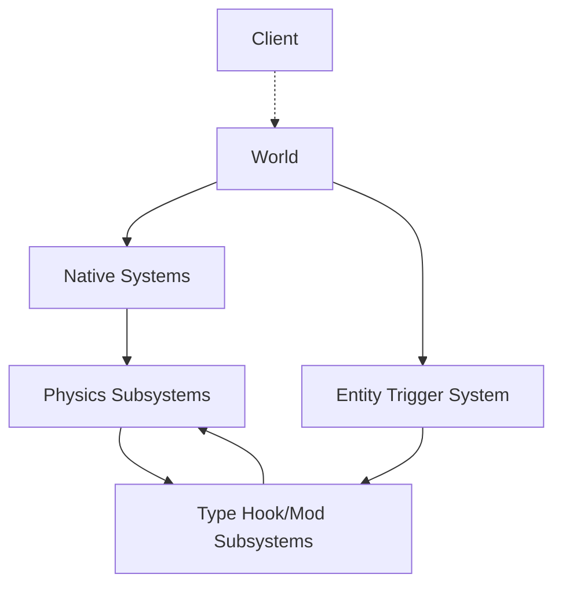

Hook Callstack:

Entities have:

- stats
- actions
- reactions

# Mods

Mods can create temporary entities.

# Game Modes

## Anarchy

All mods are allowed in the game.

## Standard

A list of approved mods are are included in the game. Mods are assigned tier, which is used to determine the drop rate.

# Governance

## Mods

Players decide what mods get included in the standard game mode in two stages:

1. **Vote for inclusion**: the mods with the most votes are included in the game
2. **Vote for tier**: players re-vote for the frequency of the included mods
