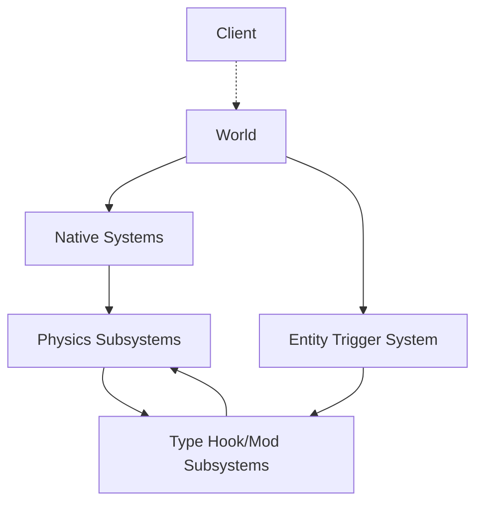

Hook Callstack:

```mermaid
graph TD;
  c[Client] -.-> w[World]
  w --> s[Native Systems]
  w --> ts[Entity Trigger System]
  s --> ss[Physics Subsystems]
  ss --> h[Type Hook/Mod Subsystems]
  ts --> h
  h --> ss
```

Entities have:

- stats
- actions
- reactions

Mods can create temporary entities.
