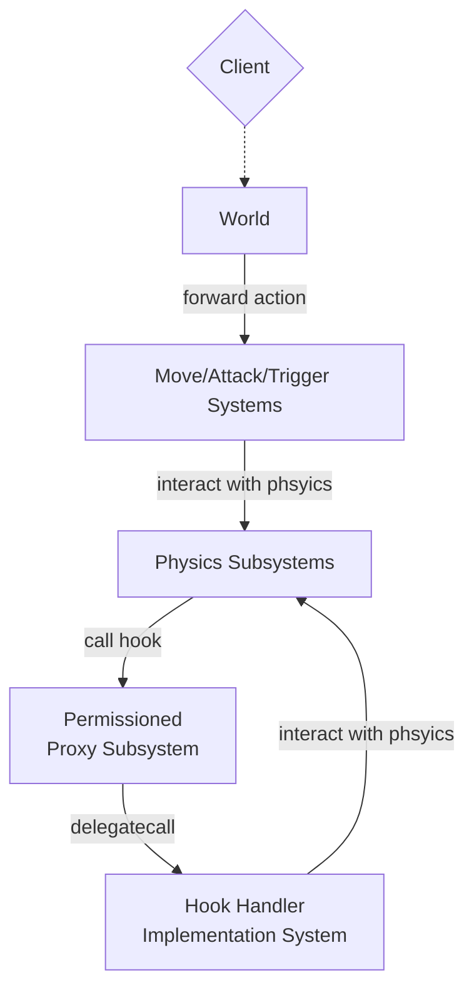

# Mod Game

Mod Game is a fully on-chain looter shooter extraction game with a twist: all items in the game are permissionlessly created by the players, all in a single persistent world.

Mod Game is a game with a goal, but it is also a sandbox of a sandbox. Anyone can create new game mechanics, combine the mechanics to create new items, and combine items to create new experiences, bound only by the physics of the world (and the gas limits 😅).

# Architecture

# Actions (Physics)

Actions (and their reactions) define how entities interaction with each other in the world. Actions restrict what entities can and can't do in the world, commonly known as the physics of the world.

The set of actions that can be performed by any entity in the game are:

- attack
- move
- trigger item
- pick up item
- drop item
- create new entity types

# Hooks (Mechanics)

Hooks allow entities to call additional actions before, during, or after an action is performed. Players can create mods with infinite complexity by creating and combining hooks.

Currently, Mod Game supports the following hooks:

- Move Hooks:
  - **onEnter**: called when an entity enters a tile
  - **onLeave**: called when an entity leaves a tile
  - **onMoveStart**: called when an entity initiates a move
  - **onMoveEnd**: called when an entity completes a move
- Attack Hooks:
  - **onAttack**: called when an entity attacks another entity
  - **onHit**: called when an entity is hit by another entity
  - **onKill**: called when an entity kills another entity
- Trigger Hooks:
  - **onTrigger**: called when an entity triggers another entity

# Mods (Items)

Players create mods by:

1. Creating a new entity type
2. Assigning attributes to the entity type
3. Assigning hooks to the entity type

The above can be completely done in using the client UI without code. However, it restricts you to the the set of existing hooks defined by the game and other players.

For more advanced players, you can create custom hooks and add it to the game permissionlessly. The game will automatically enforce the access control of the hook (hooks can only interact with the world through actions; they cannot write to tables).

# Access Control

All mods inherit the access control of the `Permissioned Proxy Subsystem`, which is restricted to only the `Physics Subsystems`. This means mods are bound by the physics of the world defined in the `Physics Subsystems`.

All mods are implemented as unregistered systems that are `delegatecall`ed by the `Permissioned Proxy Subsystem` to enforce access control.

# Game Modes

## Anarchy

All mods are allowed in the game.

## Standard

A list of approved mods are are included in the game. Mods are assigned tier, which is used to determine the drop rate.

# Governance

## Mods

Players decide what mods get included in the standard game mode in two stages:

1. **Vote for inclusion**: the mods with the most votes are included in the game
2. **Vote for tier**: players re-vote for the frequency of the included mods
